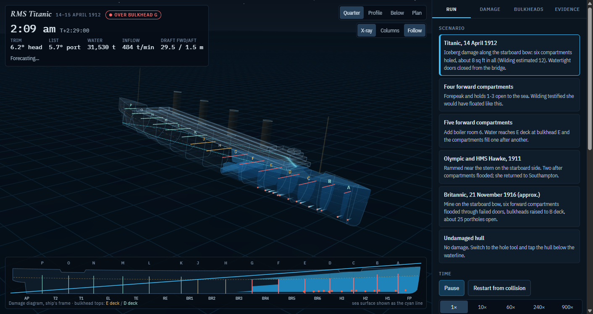
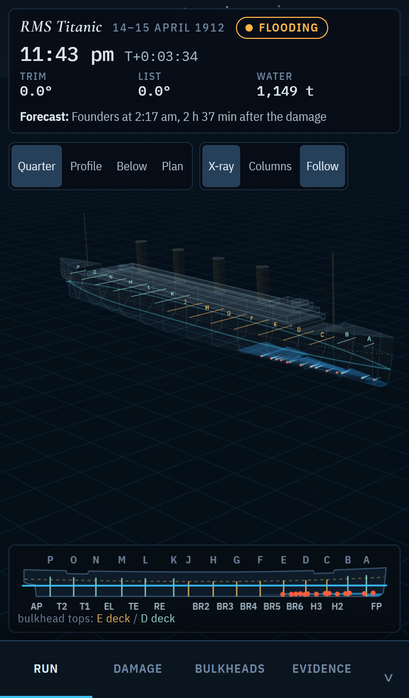
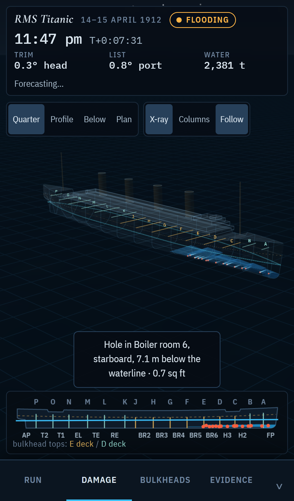
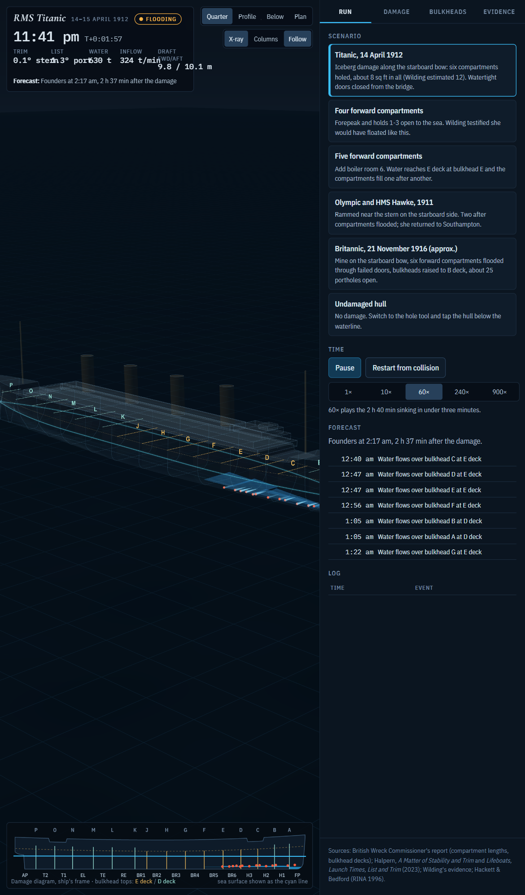
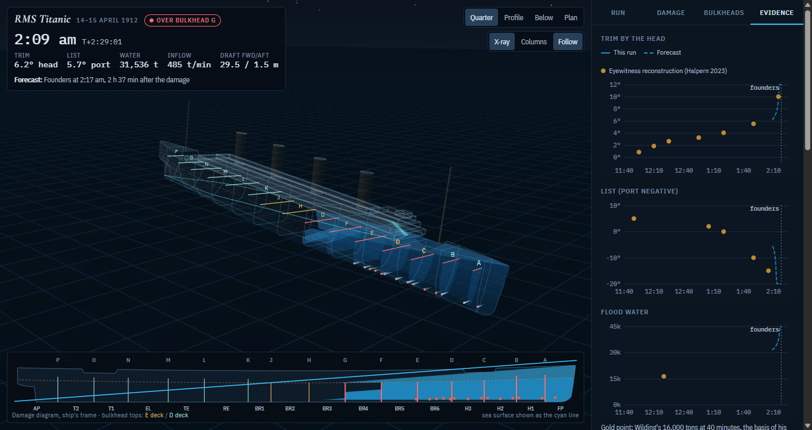
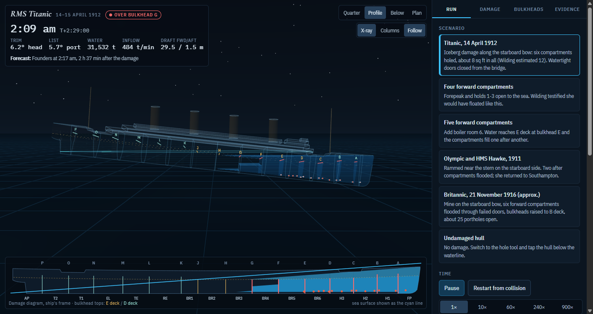
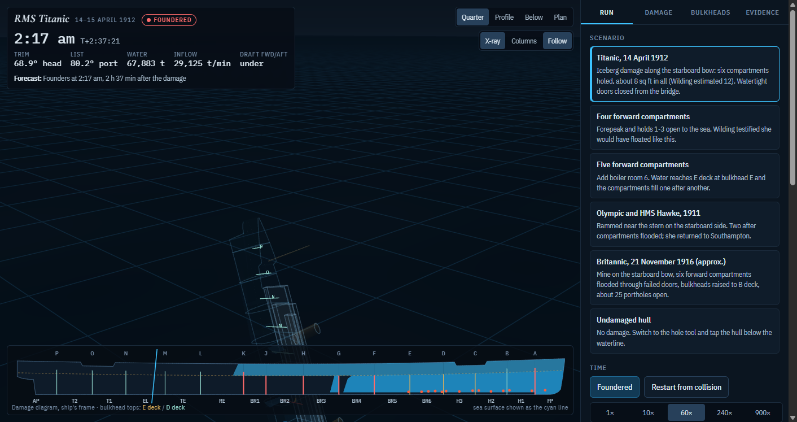

# Titanic Sinking Simulator

A flooding and sinking simulator of RMS Titanic that **computes the sinking instead of animating it**. A headless
hydrostatics core in plain JavaScript integrates buoyancy and flood water over 4,408 vertical hull columns at the
ship's actual attitude, moves water between 64 spaces through 290 orifice and weir paths, and lets a damped rigid
body find heave, pitch and roll every quarter second. Four flow parameters are fitted to the eyewitness-derived trim
curve and the foundering time; nothing else is tuned, and the model is then checked against cases it was not fitted
to: Wilding's four and five compartments, Olympic after the Hawke collision, Britannic in 1916.

> This is a physics model first and a visualization second. The three.js viewer only draws snapshots of the core's
> state. Delete `web/` and the core still runs headless, still founders at 2:17 am, still prints its validation table.



*2:09 am, 149 minutes after the collision: 6.2° down by the head, 5.7° list to port, 31,500 t of water aboard, water
flowing over bulkhead G. Quarter view with the X-ray hull; the damage diagram below shows the sea surface against the
bulkhead tops.*

## Run it

- **Viewer.** Open [`out/titanic.html`](out/titanic.html) in a browser. No install and no server: three.js and the
  fonts load from CDNs. Pick a scenario card, press play, choose a speed (1× to 900×; 60× plays the two hours and
  forty minutes in under three minutes). Quarter, profile, below and plan cameras; X-ray hull, column proxies and a
  follow camera. The Damage and Bulkheads tabs edit the scenario, the hole tool adds openings where you tap the hull,
  and the Evidence tab plots the run against the eyewitness reconstruction. Rebuild the page with `node tools/build.js`.
  That file is viewer version 1; the website build below is version 2, with a phone layout and no third-party
  requests, and it is the one to host.
- **Headless.** Node 18 or later, nothing to install:

| command | what it does |
|---|---|
| `node tools/titanic.js` | the calibrated 1912 run as a table, against the eyewitness trim and list |
| `node tools/validate.js` | the validation cases, written to `out/validation.json` (about a minute) |
| `node tools/cases.js` | the classic one- to six-compartment damage cases |
| `node tools/golden.js` | the golden trace of the 1912 run, sampled every 60 s, to `out/golden_titanic.json` |
| `node tools/calibrate.js 45` | refit the four flow parameters (about four minutes) |
| `node tools/fit_hull.js` | refit the hull form to the Harland & Wolff hydrostatics (about two minutes) |
| `node tools/shot.js 1400 860 4000 shot.png` | screenshot and drive the viewer with Playwright |

The same commands exist as npm scripts (`npm run titanic`, `npm run validate`, ...).

## The website build

`dist/` is a static site ready for Cloudflare Pages or any static host: the same model and viewer, packaged as
version 2 with a proper document, a phone layout, vendored three.js and fonts, strict headers and an installable
manifest. `CHANGELOG.md` lists what the review of version 1 found and what changed.

```bash
npm ci                   # Playwright, wrangler, three.js r128 and the fonts are dev dependencies
npm run build:site       # assembles dist/ (content-hashed assets, version.json)
npm run serve            # http://127.0.0.1:8080/ for a local look
npm run test:site        # desktop, iPhone, Pixel and iPad through Playwright; screenshots in docs/site/
npm run pages:dev        # the build under Cloudflare's local Pages runtime
```

Deploying on Cloudflare Pages: connect the repository in the dashboard with build command
`npm ci && npm run build:site` and output directory `dist`, or push a build by hand with
`npm run pages:deploy` after `npx wrangler login`. No domain is needed to start; Pages gives a `*.pages.dev`
address, and a custom domain attaches later. Set `SITE_ORIGIN=https://your.domain/` at build time so the social
preview image has an absolute URL.

<table>
<tr>
<td width="34%"></td>
<td width="34%"></td>
<td width="32%"></td>
</tr>
<tr>
<td><em>Version 2 on an iPhone: the panel is a bottom sheet.</em></td>
<td><em>A tap on the starboard shell adds a hole; the forecast recomputes.</em></td>
<td><em>Version 1 on the same phone, for comparison.</em></td>
</tr>
</table>

## What the model does

| Piece | How |
|---|---|
| Hull | Parametric form: parallel midbody, waterline exponents by height, bilge radius, raked stem, elliptical counter, sheer, tumblehome. Fitted to the Harland & Wolff hydrostatics at 32'3" and 34'7", within about 1 % on displacement, waterplane area, KB, BM, LCB and midship coefficient. |
| Proxies | 4,408 vertical columns (3 m × 0.5 m) in the ship frame. Buoyancy and flood water are both integrated over the same columns at the actual pose, so there are no lookup tables. |
| Subdivision | 15 bulkheads at the British Inquiry positions, with tops at C, D or E deck as built, giving 16 compartments. Each compartment has 4 spaces, port and starboard times below and above E deck, 64 in all. Permeability is set per compartment. |
| Water paths | 290 connections. Hull openings, doors and deck openings use an orifice law; flow over bulkhead tops and the open deck uses a weir law, Villemonte's factor when submerged. Port and starboard halves of an open space share one free surface. A full space is pressed up by the head above it. |
| Ship | Damped rigid body in heave, pitch and roll. Mass properties from the drafts of 14 April (30'9" forward, 33'9" aft) with GM 2 ft 7.5 in (Hackett & Bedford). |
| Step | 0.25 s. About 11,000 steps per second single-threaded, so a full sinking takes about three seconds headless. |

The core is deterministic, uses flat typed arrays and a fixed step, and has no DOM, so it ports line for line to
C++ and CUDA. `core/core.js` is the whole physics; `core/scenarios.js` holds the damage presets and the eyewitness data.

## Calibration

Four parameters, fitted by Nelder-Mead in `tools/calibrate.js` to Halpern's eyewitness-derived trim curve (2023),
the foundering time, and three timeline events.

| Parameter | Value | Meaning |
|---|---|---|
| Aggregate opening | 0.75 m² (8.1 sq ft) | Iceberg damage, spread over six compartments by Hackett & Bedford's flooded capacities |
| `wMul` | 1.18 | Width of the paths along E deck (Scotland Road and the alleyway) |
| `aDown` | 0.28 m² | Openings down through E deck, per side per compartment |
| `fOpen` | 0.010 | Share of the top deck open once submerged |

| Check | Witnessed | Model |
|---|---|---|
| Trim at 12:10 / 12:55 / 1:20 / 2:15 | 1.8° / 3.2° / 4.0° / 10° | 1.65° / 3.5° / 4.15° / 9.6° |
| Water over bulkhead F (Wheat) | 12:55 | 12:56 |
| Bridge under | 2:15 | 2:14 |
| Foundered | 2:20 (broke at 2:17) | 2:17 |
| 16,000 tons aboard | 12:20 (Wilding's assumption) | 12:48 |

The eyewitness timeline fits about 8 sq ft of opening. Wilding's 12 sq ft rested on 16,000 tons arriving in 40
minutes; the model takes 68 minutes to reach that much.



*The Evidence tab at 2:09 am: trim, list and flood water of the run (blue) against Halpern's eyewitness
reconstruction (gold), with the forecast to foundering dashed.*

## Validation, not used in the fit

| Case | Record | Model |
|---|---|---|
| Forepeak + holds 1–3 open | Wilding: floats | Floats, 2.0° by the head, 0.96 m below bulkhead D's top |
| Add boiler room 6 | Wilding: sinks | Founders |
| Olympic and HMS Hawke, 1911, two after compartments | Reached port | Floats, 0.7° by the stern |
| Britannic 1916 (approx.: B-deck bulkheads, failed doors, 25 open ports) | About 55 min | 50 min |
| Britannic, ports shut | Designed to float with 6 flooded | Floats, 8.8° |
| Titanic damage minus the BR5 seam | Wilding: still sinks, slower | 3 h 08 min |
| Titanic, bulkheads to D deck | Wilding: no help | 2 h 50 min |
| Titanic, bulkheads to B deck | Wilding: still sinks | Floats at 8.1°. This disagrees with Wilding; it agrees with the later Britannic design claim |
| Titanic, doors left open | Debated | 3 h 02 min, longer: water spreads aft low instead of tipping the bow |

The full table with event times is in [`out/validate.txt`](out/validate.txt).

## Known gaps

- **List.** The model gets a 2° to 6° port list, the pre-collision coal list amplified by free surfaces, but not the
  5° starboard list at 11:50 or the 10° to 15° port list at 1:50 to 2:05. Candidates are asymmetric flooding of the
  boiler-room coal bunkers, water running aft along Scotland Road, and the port gangway door Lightoller ordered
  opened. `HANDOFF.md` works each of them out.
- **Structure.** No hull girder failure. Intact, the model's last minute is a rolling plunge rather than the break-up
  at about 2:17.
- **Omissions.** No pumps, no trapped air, no buoyancy from the superstructure above B deck, no forward speed, which
  matters for Britannic.
- **Britannic.** Her hull is treated as Titanic's with a slightly narrower beam. Which six bulkheads went to B deck,
  and where the open ports were, are assumptions.

<table>
<tr>
<td width="50%"></td>
<td width="50%"></td>
</tr>
<tr>
<td><em>Profile view at 2:09 am.</em></td>
<td><em>2:17 am. The intact model ends in a plunge; the break-up is on the list.</em></td>
</tr>
</table>

## The port, and the oracle

The C++/CUDA port, [sinksim](https://github.com/bochen2029-pixel/sinksim), reproduces this model bit for bit at
every step of the 1912 run and runs batches of sinkings on the GPU, one CUDA block per simulation, for calibration
sweeps and a tree search over the watertight doors, the pumps and counter-flooding. The question it is built to
answer is whether any policy could have kept her afloat until Carpathia arrived, about 4 h 20 min after the impact,
against the 2 h 37 min of the baseline. [`PORTING.md`](PORTING.md) is the kernel plan; [`HANDOFF.md`](HANDOFF.md)
is the order of work, the invariants that are easy to lose in a port, the physics still missing, and the parameters
the author is least sure of. [`CLAUDE.md`](CLAUDE.md) holds the frames and rules a working session starts from.

Until the port matches it, **the JavaScript core is the oracle** and [`out/golden_titanic.json`](out/golden_titanic.json)
is its frozen trace: the 1912 run sampled every 60 s with pose, rates and all 64 volumes. One caveat was measured
while preparing the port: `Math.pow` in V8 calls the C runtime Node was built against, so a golden trace made on
another machine can differ in the last bit, and this model, like any flooding model with threshold events, turns one
ulp into event times that differ by up to 24 s after about an hour of simulated time. The measurement, and a header
that reproduces Node's `Math.*` bit for bit in C++, are in the companion repository
[v8math](https://github.com/bochen2029-pixel/v8math). Regenerate the oracle on the machine that will consume it.

## Layout

```
core/core.js        the flooding core: hull, columns, nodes, connections, step, rigid body, events, snapshots
core/scenarios.js   damage presets (1912, four and five compartments, Olympic-Hawke, Britannic) and the eyewitness data
web/                viewer version 1 (app.js) and its page template, built into out/titanic.html
site/               viewer version 2: page template, stylesheet, app, worker glue, icons, Cloudflare headers
dist/               the built website (npm run build:site)
tools/              headless runs, validation, cases, calibration, hull fit, golden trace, builds, site tests, screenshots
out/                the version 1 page, the golden trace, validation results, calibration log
docs/               screenshots; docs/site/ holds the device-test captures
PORTING.md          how the core maps onto C++/CUDA, and the golden tests a port must pass
HANDOFF.md          order of work, invariants, physics gaps, uncertain parameters, the Carpathia question
CLAUDE.md           conventions and rules for working sessions
```

## Sources

- British Wreck Commissioner's report: compartment lengths and bulkhead decks.
- Halpern, *A Matter of Stability and Trim*: displacement, KB, BM, GM, LCF, drafts.
- Halpern, *Lifeboats, Launch Times, List and Trim*, Part II (2023): trim and list against time.
- Wilding's evidence at the British Inquiry: 12 sq ft, 16,000 tons, a head of about 25 ft.
- Hackett & Bedford, *The Sinking of S.S. Titanic, Investigated by Modern Techniques*, RINA Transactions 1996.
- Chirnside on Britannic's open ports and the Olympic-class subdivision.

## License

MIT. The viewer loads [three.js](https://threejs.org/) (MIT) from a CDN at runtime.
